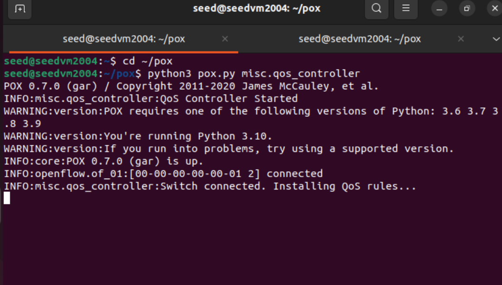
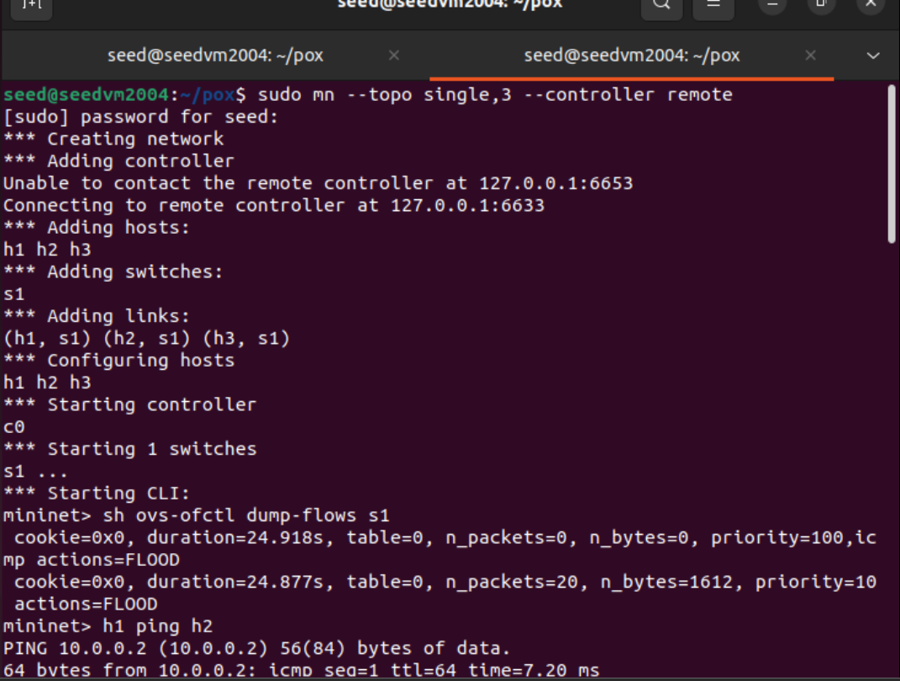
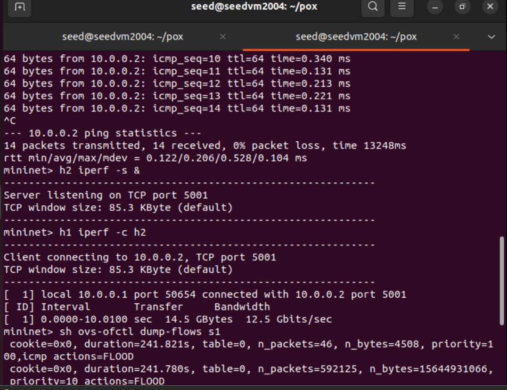
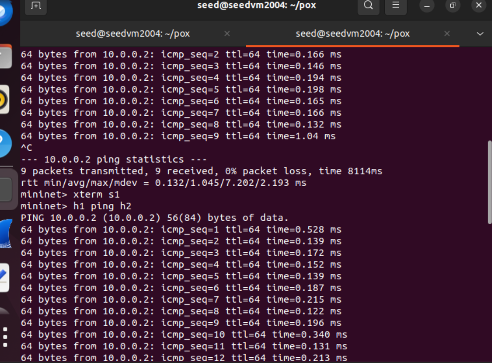
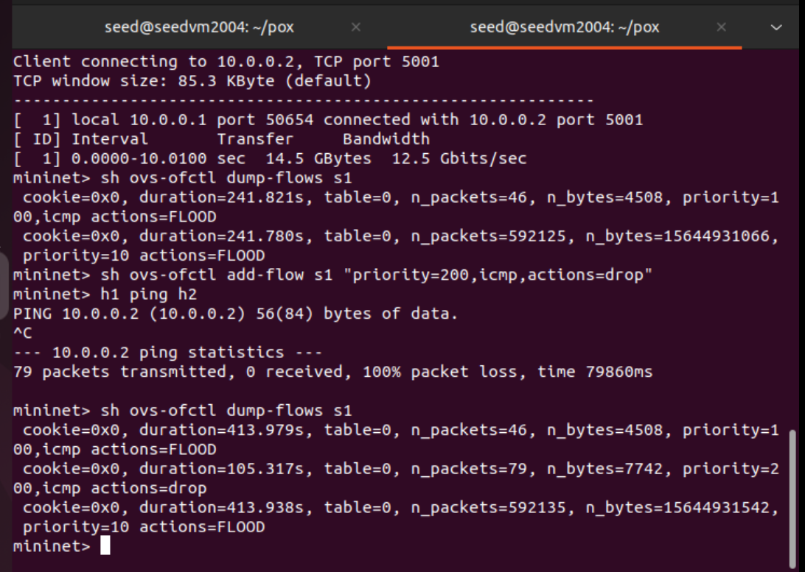

# SDN QoS Priority Controller using POX and Mininet

## Problem Statement
The objective of this project is to implement a simple Quality of Service (QoS) controller using Software Defined Networking (SDN). The controller prioritizes ICMP traffic (ping packets) over normal traffic using OpenFlow rules. The project demonstrates how SDN enables dynamic traffic control and priority-based forwarding in a network.

---

## SDN Architecture
The architecture consists of three main layers:

Application Layer:
Contains the QoS logic implemented in Python using the POX controller.

Control Layer:
POX SDN Controller manages traffic rules and communicates with the switch using OpenFlow protocol.

Infrastructure Layer:
Mininet emulates the network topology with hosts and Open vSwitch.

---

## Mininet Topology Design
Topology used:
Single switch topology with 3 hosts.

Command used:
sudo mn --topo single,3 --controller remote

Topology structure:

h1 ----\
        \
h2 -----  s1 ----- POX Controller
        /
h3 ----/

Where:
h1, h2, h3 = hosts
s1 = OpenFlow switch
Controller = POX controller running QoS logic

---

## Controller Implementation
POX controller is used to install OpenFlow rules which define traffic priority.

Python module:
misc.qos_controller

The controller installs flow rules in the switch that define how packets should be handled based on priority.

---

## Flow Rule Management
Flow rules are installed using OpenFlow.

Example rules:

High priority ICMP traffic:
priority=100, icmp, actions=FLOOD

Normal traffic:
priority=10, actions=FLOOD

Blocking traffic example:
priority=200, icmp, actions=drop

Higher priority value means rule is applied first.

---

## Functionality Implementation

### Scenario 1: Normal Communication
Hosts communicate successfully when flow rules allow traffic.

Test command:
h1 ping h2

Expected result:
0% packet loss

---

### Scenario 2: Priority based traffic
ICMP traffic is given higher priority than other traffic.

Verification:
Flow table shows higher priority value for ICMP packets.

---

### Scenario 3: Failure case (blocked traffic)
Controller installs rule to block ICMP packets.

Command used:
sh ovs-ofctl add-flow s1 "priority=200,icmp,actions=drop"

Test command:
h1 ping h2

Expected result:
100% packet loss

This shows controller can control traffic behaviour dynamically.

---

## Performance Evaluation

### Ping Test
Checks connectivity between hosts.

Command:
h1 ping h2

Shows latency and packet loss.

---

### iperf Test
Measures bandwidth between hosts.

Commands:
h2 iperf -s &
h1 iperf -c h2

Shows throughput in Gbits/sec.

---

## Python Script
Python controller file:
qos_controller.py

The script installs flow rules in the switch using OpenFlow protocol.

It ensures ICMP traffic receives higher priority.

---

## Execution Steps

### Step 1: Start POX controller
cd ~/pox
python3 pox.py misc.qos_controller

---

### Step 2: Start Mininet topology
sudo mn --topo single,3 --controller remote

---

### Step 3: Check flow rules
sh ovs-ofctl dump-flows s1

---

### Step 4: Test connectivity
h1 ping h2

---

### Step 5: Test bandwidth
h2 iperf -s &
h1 iperf -c h2

---

### Step 6: Test failure scenario
sh ovs-ofctl add-flow s1 "priority=200,icmp,actions=drop"
h1 ping h2

Expected output:
100% packet loss

---

## Demo

---

## Conclusion
This project demonstrates how SDN controllers can dynamically control network traffic using priority rules. By using POX controller and Mininet, QoS policies were implemented and tested successfully. The results show that ICMP traffic can be prioritized or blocked using OpenFlow rules, proving the effectiveness of SDN-based traffic management.

---

## References

Mininet documentation:
http://mininet.org

POX controller documentation:
https://github.com/noxrepo/pox

OpenFlow specification:
https://opennetworking.org

Wireshark:
https://www.wireshark.org